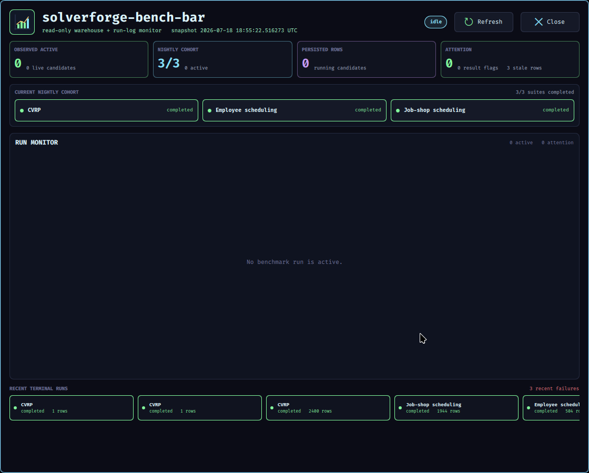

# solverforge-bench-bar

`solverforge-bench-bar` is a read-only Waybar and QuickShell companion for monitoring running `solverforge-bench` workloads in real time.

It uses a Ruby daemon to query persisted benchmark progress through a forced read-only PostgreSQL session, inspects bounded tails of the run logs already referenced by the warehouse, writes a cached JSON snapshot, renders a compact Waybar chip, and opens a detailed QuickShell modal.

It never launches, stops, retries, repairs, or otherwise mutates benchmarks.



## Version

The current development version is `0.1.0`. `SolverForgeBenchBar::VERSION` in `lib/solverforge_bench_bar.rb` is the application-version source of truth. Config schema version `1` and snapshot schema version `1` evolve independently from the application version.

## Runtime Shape

```text
PostgreSQL SELECT (read-only) --\
                                Ruby daemon -> snapshot.json -> Waybar
bounded run-log tails --------/               -> QuickShell
```

PostgreSQL supplies persisted run and result truth. Each refresh fetches bounded running candidates, an independently bounded current-nightly cohort, and bounded recent terminal runs. Log events supply current solver activity and evidence for stale warehouse rows. Raw warehouse status and derived observed state remain separate.

## Commands

```bash
solverforge-bench-bar help
solverforge-bench-bar config init
solverforge-bench-bar config validate
solverforge-bench-bar snapshot --format json --pretty
solverforge-bench-bar refresh
solverforge-bench-bar daemon
solverforge-bench-bar daemon --once
solverforge-bench-bar panel
solverforge-bench-bar ui open|close|toggle|status
solverforge-bench-bar waybar render|refresh|panel
```

## State

- Config: `~/.config/solverforge-bench-bar/config.json`
- Runtime state: `~/.local/state/solverforge-bench-bar/`
- Installed application: `~/.local/share/solverforge-bench-bar/`
- User binary: `~/.local/bin/solverforge-bench-bar`

Waybar reads cached state only. Live PostgreSQL and log reads happen during `refresh`, `snapshot`, or daemon refresh work.

The state directory is private (`0700`); JSON state and lock files are `0600`. Source failures preserve the last good run data and mark the snapshot source as failed.

## Install

```bash
make check
make configure-user
make install-solverforge-linux-integration
```

`make configure-user` installs the application and creates the user config only when it is absent. The integration target installs only the `solverforge-waybar-benchbar` adapter; the `custom/benchbar` module and companion-daemon supervision remain owned by the SolverForge Linux managed default layer. Do not edit symlinked files under `~/.config/waybar`.

## Validation

`make check` is deterministic and does not contact the live warehouse. `make release-check` is an alias for that gate. Use `make check-live-readonly` only for the explicit forced-read-only live smoke.

See `WIREFRAME.md` for the shipped interface and runtime contract.
